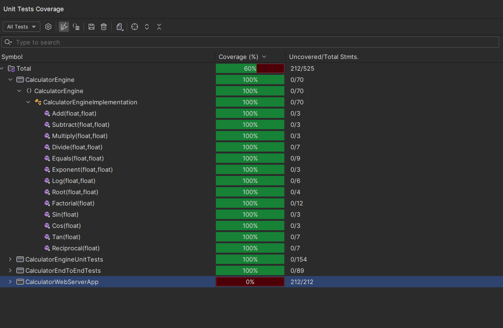

# KSU SWE 3643 Software Testing and Quality Assurance Semester Project: Web-Based Calculator

Welcome to the project repository for my calculator Project assigned in Software Testing and Quality Assurance. Here you will find
all source code for the Calculator project. The Project was created using C#, NUnit, Blazor, and Playwright. 

## Table of Contents
- [Team Members](#team-members)
- [Enviornment](#enviornment)
- [Architecture](#architecture)
- [Executing the Web Application](#executing-the-web-application)
- [Executing Unit Tests](#executing-unit-tests)
- [Reviewing Unit Test Coverage](#reviewing-unit-test-coverage)
- [Executing End-To-End Tests](#executing-end-to-end-tests)
- [Final Video Presentation](#final-video-presentation)

## Team Members
- R.J Straiton

## Architecture
This project implements a Model-View-Controller, or MVC, architecture. The Calculator solution consists of four projects: 
1) CalculatorEngine - The library containing all logic needed for the application.
2) CalculatorEngineUnitTests - All unit tests for CalculatorEngine, achieves 100% coverage for the calculator logic.
3) CalculatorWebServer - The web application which references CalculatorEngine, developed using Blazor.
4) CalculatorEndToEndTests - The end-to-end tests for the web server, developed using Playwright.


## Enviornment
### This is a cross-platform application that works on Windows 11.

To prepare your enviornment to execute this application:
- [Install .NET 8.0](https://dotnet.microsoft.com/en-us/download)
- Clone this repository
- Open up the terminal
- Navigate to wherever you downloaded the Calculator solution
- Example:
```
cd RiderProjects
cd Calculator
```
To set up Playwright for end-to-end testing:
- [Follow these steps on how to install Playwright](https://playwright.dev/dotnet/docs/intro)


## Executing the Web Application
To execute the web application follow these steps:
- Open the command prompt
- Navigate to the directory where you have installed the Calculator solution and open the Calculator directory
- Once inside of the calculator directory open the CalculatorWebServerApp
- Type "dotnet run" into the command prompt
- Open a browser and type in "localhost:5194"
- When you are ready to close the web server, open the command propmt and press Ctrl+C to shut it down

## Executing Unit Tests
To Execute the unit tests follow these steps:
- Open the command prompt
- Navigate to the directory where you have installed the Calculator solution;
- Open the CalculatorEngineUnitTests directory using: cd CalculatorEngineUnitTests
- Once in this directory, type "dotnet test" into the command propmpt and watch as the tests begin to run and pass!

## Reviewing Unit Test Coverage
The coverage that my Calculator Logic achieved was 100%.


## Executing End-To-End Tests
In order to execute the end-to-end tests please follow the previous steps for executing the web application
- Open a new tab in the terminal and navigate back to the Calculator directory
- Once in the Calculator directory navigate to the CalculatorEndToEndTests directory
- Enter "dotnet run" and see the results
- Don't forget to close the web application when you are done, this can be done with Cntrl+C

## Final Video Presentation 
